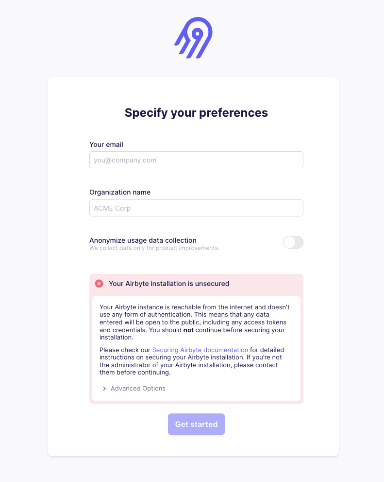
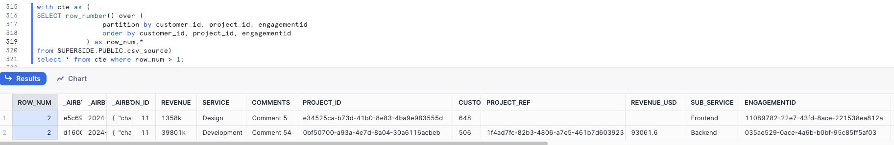

# SuperSide Solution

# Requirements

### Input data

- 10 TB per day every 6 hours
- Data sources:
    - OLTP
    - JSON, XML
    - unstructured data (emails, pdf, documents, images)
    - Partners (Amazon, Facebook, SalesForce)
- Latency 3-5 hours

# SuperSide Data Analytics Solution Proposal

As businesses grow and data volumes increase, analytical solutions have become an essential part of a company’s success. Nowadays companies require efficient platforms for collecting, storing, processing, and analyzing information. These systems not only support better decision-making but also streamline processes, optimize costs, and uncover new business opportunities.

I got a task to explore and purpose Data Solution for SuperSide. Based on use cases from requirements rapidly growing organization working with global brands and handling diverse internal and external data sources, several key challenges arise:

**Optimizing Business Operations**

Team productivity

Workload forecasting

**Managing Client Data and Enhancing Service**

Client Engagement Analysis

Retention Analysis

**Improving Marketing Efficiency**

Marketing Campaign Effectiveness


My architecture diagram presents a comprehensive data ecosystem for SuperSide's data solution. Here's a brief description of the key components and data flow:

1. Data Sources:
    - Various sources including Amazon, Facebook, Salesforce
    - Different data types: PDFs, emails, JSON, XML, and OLTP databases
2. AWS Infrastructure:
    - The core infrastructure is built on AWS, enclosed in a VPC for security
    - Key AWS services used: EKS (for Kubernetes), S3, Lambda, and Secrets Manager
3. Data Ingestion and Processing:
    - AirByte is used for data integration from various sources
    - Apache Airflow for orchestrating ETL workflows and scheduling jobs for DBT and AirByte
    - OpenMetadata for metadata management
4. Data Storage and Warehousing:
    - Snowflake as the primary data warehouse
    - PostgreSQL used as an interim database for data preparation (marked as "not for prod") simple OLTP
5. Data Flow:
    - Data from sources is ingested into S3
    - Processed through AirByte and Airflow
    - Loaded into Snowflake for analytics and reporting
    - Sigma connected to Snowflake for data visualization and analysis
6. Infrastructure Management:
    - GitHub for version control and CI/CD
    - Airflow DAGs stored in GitHub and synced to the Airflow system
7. Monitoring and Logging:
    - Airflow dashboard for monitoring workflows
    - Airflow logs stored in S3 buckets
8. Security:
    - VPC for network isolation
    - Secrets Manager for managing sensitive information

This architecture provides a scalable, robust solution for handling SuperSide's diverse data needs, from ingestion to processing and analysis, while maintaining security and operational efficiency.

# Tool Selection

Usually main question is **OSS** or **Paid** solution

I have one small table for you:

| Type | Open/Blackbox | Community | Protocols | Support | Costs |
| --- | --- | --- | --- | --- | --- |
| OSS | Multiple solutions, free to explore, choose and decide | A chance to learn from the community, experiment and tweak solutions that best work for your org | Open protocols | No support, you’re at the whim of the community - could be disastrous during downtimes, urgent needs | Cheap, easy to get, and usually works for smaller orgs |
| Paid | Blackbox - At the behest of a vendor | Complete vendor lock-in. You will get what is being offered | Proprietary protocols | Complete support to debug issues, but comes at a cost | Costs spiral out of control hampering multiple teams |

## Storage Considerations

> **Redshift**
> 

I noticed that you are using AWS, that’s why Redshift will be the first candidate as  data warehouse product:

it could be Platform as a Service (PaaS) or Software as a service (SaaS)

It could be used only inside AWS ecosystem

As a PaaS, Redshift provides more customizability and capacity, but also requires more maintenance effort. Using Massive Parallel Processing, Redshift speeds up and eliminates repetitive ELT/ETL tasks. Data compression in Redshift is not automated by default. You can customize Redshift’s compute nodes and cluster size. Redshift supports both cloud and on-premises environments. Redshift is based on PostgreSQL for handling structured, semi-structured  like JSON, Avro, and Parquet, and unstructured data warehouse functions. Redshift supports User Defined Functions (UDFs) with scalar and aggregate functions. Redshift clusters take 15-60 minutes to scale up. Amazon Redshift can handle petabyte-scale data volumes (up to 128 TB per node). Redshift uses a reserved instance pricing model. Amazon Redshift leverages AWS Identity and Access Management (IAM) for authentication and access control, which is particularly beneficial for businesses already using other AWS services. Redshift Spectrum or Redshift Serverless can query Apache Iceberg tables (Apache **Iceberg** is a high-performance **format** for huge analytic tables). Migration cost is huge.

> **Athena**
> 

Athena is designed to be an ultra-fast and portable serverless option. Amazon Athena is ideal for operations using Presto and ANSI SQL based datasets on Amazon S3. Amazon Athena delivers near-instant startup. Athena analyzes data where it lives. Athena is built on an open-source framework (Apache Spark), it supports more than 25 data sources, including both on-premises and cloud-based one that use Python and SQL. Amazon Athena accommodates complex data types including arrays, structs, maps and Object Identifier Types. Supports Apache Iceberg tables. Data is stored in S3 bucket in parquet format.

> **Amazon EMR Serverless**
> 

Amazon EMR is the industry-leading cloud big data solution for petabyte-scale data processing, interactive analytics, and machine learning using open-source frameworks such as Apache Spark, Apache Hive, and Presto. Manage your data with Amazon S3. EMR service processes your data using Amazon Elastic Compute Cloud. Supports Data Lake. Could be used with Amazon Cloudwatch. Cost reduction of physical infrastructure, but it require stronger dev team.

> **Databricks**
> 

Databricks is a SaaS, it requires less management effort, but comes at the cost of fewer configuration options and capacity than a PaaS platform. Databricks separates compute and storage to support high concurrency rates and independent scaling. Databricks works across AWS, GCP, and Azure. Databricks uses Apache Spark, an open-source framework that supports ultra-fast in-memory processes. Databricks runs Spark SQL to interact with structured data. It require big team, code on PySpark and Spark.

> **BigQuery**
> 

Decoupled data storage from computing resources can seamlessly scale to meet mission-critical requirements. A serverless architecture that automatically scales (up or down) its resources based on computing needs. With its columnar format, BigQuery’s storage layer is optimized for analytical workloads, thus offering better performance over row-based formats. Slot-based compute layer allows users to run multiple queries with automatic scalability of the available slots. BigQuery charges its users based on the consumed slots for its virtual CPU.

> **Snowflake**
> 

Storage and compute run on separate layers within Snowflake’s cloud data platform. Scalability and concurrency are seamless with this architecture, ensuring high performance at all times. Snowflake, a SaaS, you don’t have to install additional software or hardware. Plus, Snowflake takes care of all system updates, upgrades, and other maintenance for you. Snowflake uses a custom approach to reduce latency. The Snowflake service automatically compresses your data and charges you based on the compressed volume. Snowflake’s fully managed data cloud allows you to set your cluster size, but you cannot customize compute nodes. Snowflake offers high performance, cloud-native support, and always-on encryption. Snowflake works natively across AWS, Azure, and GCP. Low entry for new devs, they need to know SQL. Works perfect with DBT. Team is delivering fast, reliable code with no limitations on performance, concurrency, or scale. Thanks to its multi-cluster, shared data architecture, it scales horizontally and vertically on demand, delivering fast response times regardless of load. And because it is delivered as a service, Snowflake improves developer productivity without the need to maintain infrastructure.

> **Trino**
> 

OpenSource, Trino is primarily focusing on distributed SQL querying across data warehouses and data lakes. Uses polymorphic table function. It could query external databases with JSON and XML formats. Deploying in k8s. It requires bigger team, big processing pods and nodes and problems with optimization.

## Data Processing and Integration Considerations

### Processing

> **AirByte**
> 

AirByte is an open-source data integration platform that syncs data from applications, APIs & databases to data warehouses, lakes and other destinations. Huge amount connectors. Flexibility self-hosted or cloud-hosted. AirByte's built-in features such as throttling, error handling, retries, and rate limits. Big community. 

> **Meltano**
> 

Meltano aims to bring the benefits of open source and DevOps best practices into the data lifecycle to help better manage all the tools in a data stack. It is open source, self-hosted, CLI-first, debuggable, and extensible. Limited orchestration capabilities. k8s support.

> **Fivetran**
> 

Fivetran is a versatile data integration platform that offers a wide range of digital connectors, making it a valuable tool for organizations that require multiple data sources for making informed business decisions. Fivetran a popular choice for near real-time data replication between source systems and organization-wide databases, including traditional RDBMS, APIs, and SAP HANA. It also supports data transformations, proving useful for specific use cases.  It also serves as an Extract Transform Load provider, seamlessly bringing data from third-party services into data warehouses. Expensive, row based calculation.

> **Stitch**
> 

Stitch is a cloud-based platform for ETL — extract, transform, and load. Sources are only structured. It hasn’t integration with data stack. Annual contracts. Volume-based pricing with new added or edited rows. No flexibility to develop Python data pipelines.

### Integration

> **DBT**
> 

DBT is a SQL-first transformation workflow that lets teams quickly and collaboratively deploy analytics code following software engineering best practices like **modularity**, **portability**, **CI/CD**, and **documentation** such that anyone on the data team can safely contribute to production-grade data pipelines. 2 versions: DBT Core (free) or DBT Cloud (paid). Core could be deployed as container. 

[https://cdn-images-1.readmedium.com/v2/resize:fit:800/0*FWeUQA91rdexE_Wx](https://cdn-images-1.readmedium.com/v2/resize:fit:800/0*FWeUQA91rdexE_Wx)

- **SQL-based transformations**

Developers write SQL queries to perform transformations on data. Easy to maintain and develop, fast start for new developers to be productive. Less time onboarding process.

- **Data warehouse integration**

DBT is designed to work with modern data warehouses such as Snowflake, BigQuery, Redshift, and others. It leverages the performance and scalability of these platforms to handle large datasets.

- **Version control**

Transformations and models are written as code and can be version-controlled using Git, enabling collaborative development and easy tracking of changes.

- **Testing**

DBT allows users to write tests to ensure data quality and integrity. These tests can check for conditions like uniqueness, non-null values, and referential integrity.

- **Documentation**

Users can document their data models and transformations directly in DBT. This documentation is automatically generated and can be viewed in a web-based interface.

- **Dependency management**

DBT manages dependencies between transformations. It ensures that transformations are executed in the correct order, based on their dependencies.

- **Modularity and reusability**

Transformations can be modular, allowing for code reuse and better organization. Users can define macros and reusable snippets of SQL code.

- **Scheduling and orchestration**

While DBT itself does not handle scheduling, it can be integrated with orchestration tools like Airflow or Prefect to manage the scheduling and execution of transformations.

> **Matillion**
> 

Paid. In cloud. Complete pushdown architecture, ELT tools, data ops management, and data pipeline orchestration — all in one centralized platform. It has pre-built connectors, can connect to any API source, has graphical UI. No code review (low code platform). Git integration doesn’t exist, no ci/cd or terraform, dev instance will need another licence.

> **PySpark (in case of Databricks)**
> 

Apache Spark is a multi-language engine for executing data engineering, data science, and machine learning on single-node machines or clusters. Implementing the transforms using Spark SQL is pretty straightforward as long as you understand Python (or Java/Scala depending on which Spark API you are using). It’s the rest of the setup that makes it a challenge. Spark is a great tool if you have big data workloads which need a lot of heavy lifting, and you have the engineers available to build the pipelines. Spark is still a lot more expressive than SQL, and you have much more control over how the processing is done in Spark than in SQL.

## Orchestration

> **Airflow**
> 

Apache Airflow is an open-source platform to programmatically author, schedule, and monitor workflows. It uses directed acyclic graphs (DAGs) of tasks for workflow orchestration.

**Distinctive features:**

- Python-based, allowing dynamic pipeline generation
- Extensive operator library for various integrations
- Rich UI for monitoring and managing workflows
- Strong community support and extensive ecosystem

> **Databricks**
> 

Databricks is a unified analytics platform that integrates with cloud storage and cloud computing platforms. While not primarily an orchestration tool, it includes workflow orchestration capabilities.

**Distinctive features:**

- Tight integration with Apache Spark
- Notebook-based development environment
- Built-in versioning and collaboration features
- Optimized for big data processing and machine learning workflows

> **Astronomer**
> 

Astronomer is a managed Airflow platform, providing an enterprise-grade solution built on top of Apache Airflow. Native k8s support.

**Distinctive features:**

- Simplified Airflow deployment and management
- Enhanced security features
- Dedicated support and training
- Pre-built integrations and templates

> **Dagster**
> 

Dagster is an open-source data orchestrator for machine learning, analytics, and ETL. It's designed to make data pipelines more maintainable and testable. Native k8s support.

**Distinctive features:**

- Strong focus on data quality and testing
- Support for gradual adoption in existing projects
- Asset-based (data-centric) and op-based (compute-centric) APIs
- Integrated data lineage and data observability

> **Prefect**
> 

Prefect is a modern workflow management system designed to handle complex data pipelines. It aims to eliminate negative engineering with a positive engineering approach. Native k8s support. Pure Python.

**Distinctive features:**

- Hybrid model supporting both push and pull task scheduling
- Dynamic, imperative workflows
- Built-in failure recovery mechanisms
- Cloud and server deployment options with a user-friendly UI

> **AWS Glue**
> 

AWS Glue is a fully managed extract, transform, and load (ETL) service that makes it easy to prepare and load data for analytics. Paid (AWS Service).

**Distinctive features:**

- Serverless architecture
- Automatic schema discovery
- Built-in job scheduling and monitoring
- Tight integration with other AWS services

## Security and Networking Considerations

1. Network Segmentation: Using subnets to isolate different parts of application for enhanced security
2. Least Privilege: IAM roles are always grant the minimum permissions necessary for the task at hand
3. Access Control: Using a combination of Security Groups (stateful, instance-level firewall) and Network ACLs (stateless, subnet-level firewall) to control inbound and outbound traffic
4. Encryption: Data is encrypted both at rest (e.g., EBS volumes, S3 buckets)
5. Monitoring and Auditing: Using AWS CloudWatch, VPC Flow Logs, and AWS Config to track changes and detect anomalies
6. Credential Management: Using AWS Secrets Manager to securely store and automatically rotate credentials
7. Regular Updates: Keep all systems, including the OS and applications, up-to-date with the latest security patches

## Operational Excellence Considerations (DevOps)

- Terraform (Infrastructure as a Code) / EKS / k8s / EC2
- CI/CD
- [Pre-commit](https://pre-commit.com/)
- [Linting SQL](https://docs.sqlfluff.com/en/stable/production/pre_commit.html)
- [Formating SQL](https://docs.sqlfmt.com/integrations/pre-commit)
- Code review
- Backups
- Cost monitoring and budgeting

## Data Governance Considerations

### Data Catalog

The implementation of a Data Catalog, such as **OpenMetadata**, is crucial in today's data-driven landscape. It addresses several key challenges that organizations face when dealing with large volumes of diverse data such as Data Discoverability, Data Governance and Compliance, Collaboration and Knowledge Sharing, Operational Efficiency, Data Quality and Trust. OpenMetadata, being an open-source solution, offers additional benefits such as flexibility, customizability, and community-driven development. Its comprehensive metadata model and API-first architecture make it particularly suited for modern, complex data ecosystems.

### Data Quality

Data quality testing is a crucial aspect of maintaining a reliable and trustworthy data ecosystem. DBT provides a powerful framework for implementing these tests as part of your data transformation process

> Most common types of DBT tests
> 
1. Freshness Tests

```yaml
models:
  - name: my_model
    tests:
      - freshness:
          warn_after: {count: 12, period: hour}
          error_after: {count: 24, period: hour}
```

1. Not Null Tests

```yaml
models:
  - name: my_model
    columns:
      - name: id
        tests:
          - not_null
```

1. Uniqueness Tests

```yaml
models:
  - name: my_model
    columns:
      - name: id
        tests:
          - unique
```

> Benefits of DBT Tests
> 
1. **Automated Quality Checks**: Integrates data quality testing directly into the transformation process
2. **Early Error Detection**: Identifies issues before they propagate through the data pipeline
3. **Documentation**: Tests serve as executable documentation of data expectations
4. **Scalability**: Easy to apply tests across multiple models and maintain as the data warehouse grows

> Best Practices
> 
1. Implement tests for all critical data models and columns
2. Use a combination of generic and custom tests for comprehensive coverage
3. Regularly review and update tests as data models evolve
4. Monitor test results and set up alerts for failures (push to slack)

### Data Observability

Data Observability is crucial for maintaining the health, performance, and reliability of modern data systems

**Alerting** - main purpose to notify teams of issues or anomalies in data systems

**On-Call Engineering** - ensure rapid response to critical issues outside of regular work hours

**Monitoring Platforms** such as DataDog and Grafana

> Benefits of Data Observability
> 
- **Proactive Issue Detection**: Identify and address problems before they impact end-users
- **Improved System Reliability**: Maintain high uptime and performance through continuous monitoring
- **Faster Incident Resolution**: Reduce mean time to resolution (MTTR) with real-time alerts and detailed system insights
- **Data-Driven Decision Making**: Use historical performance data to inform system improvements and capacity planning

Also we can use Monte Carlo Data (automated monitoring across production tables, down to your most critical fields), Great Expectations, Data Fold

# Onboarding and Maintenance Plan for Lead Data Engineer

## First 30 Days: Understanding the Current State

1. **System Overview**
    - Study the existing data ecosystem architecture
    - Review current ETL processes and data flows
    - Analyze the tech stack and infrastructure
2. **Identify Pain Points**
    - Conduct interviews with team members
    - Review incident reports and performance metrics
    - Identify bottlenecks in data processing and delivery
3. **Documentation Review**
    - Examine existing documentation for gaps
    - Start documenting undocumented processes
4. **Initial Assessment**
    - Prepare a preliminary report on the current state of the data ecosystem
    - Highlight immediate areas for improvement

## 90-Day Plan: Stakeholder Engagement and Strategic Planning

1. **Meet All Stakeholders**
    - Schedule meetings with key stakeholders from various departments
    - Understand their data needs and priorities
2. **Learn Priorities**
    - Compile a list of stakeholder priorities
    - Analyze how these priorities align with current capabilities
3. **Gap Analysis**
    - Identify gaps between stakeholder needs and current system capabilities
    - Prioritize improvements based on business impact
4. **Strategic Roadmap**
    - Develop a strategic roadmap for system improvements
    - Present the roadmap to stakeholders for feedback and buy-in
5. **Team Assessment**
    - Evaluate the current team's skills and capacity
    - Identify any skill gaps that need to be addressed
6. **Implement Quick Wins**
    - Identify and implement small, high-impact improvements
    - Demonstrate early value to stakeholders
7. **Long-term Planning**
    - Begin planning for major system enhancements or overhauls
    - Consider scalability and future growth in all plans
8. **Establish KPIs**
    - Define key performance indicators for the data ecosystem
    - Set up monitoring and reporting mechanisms
9. **Knowledge Sharing**
    - Organize knowledge sharing sessions with the team
    - Begin establishing best practices and coding standards
10. **Continuous Improvement**
    - Set up regular review cycles for processes and systems
    - Encourage a culture of continuous improvement within the team

# Solution

To build whole data solution I need to get on entry point: AWS account, IAM Role and Snowflake account

Based on the requirements and on my experience I have a proposal to build robust data solution. I would like to describe my solution with some points. I would like to build modern data flow as I would suggest for production with ingestion to Snowflake and implementing all Transformations with DBT (data build tool) and load back to Snowflake separated by medallion architecture (bronze, silver, gold).

1. Terraform (IasC) creating for AWS VPC, Subnets, SM, S3, IAM
2. AWS EKS
3. Airflow (orchestration)
4. PostgreSQL (required in instructions, not for prod) for me it is just OLTP backend database
5. AirByte (ingestion)
6. Snowflake (DataWarehouse)
7. DBT (data transformation)
8. Sigma (BI tool)

**Prerequisites:**

- [Terraform 0.14+](https://developer.hashicorp.com/terraform/tutorials/aws-get-started/install-cli) installed locally
    
    ```bash
    brew tap hashicorp/tap
    ```
    
    ```bash
    brew install hashicorp/tap/terraform
    ```
    
- [AWS account](https://portal.aws.amazon.com/billing/signup?nc2=h_ct&src=default&redirect_url=https%3A%2F%2Faws.amazon.com%2Fregistration-confirmation#/start) with credentials [configured for Terraform](https://registry.terraform.io/providers/hashicorp/aws/latest/docs#authentication)
- [AWS CLI](https://docs.aws.amazon.com/cli/latest/userguide/install-cliv2-mac.html)
- [kubectl](https://kubernetes.io/docs/tasks/tools/)
- `t3.xlarge` instance type for EKS

Used terraform providers:

- airbytehq/airbyte
- Snowflake-Labs/snowflake
- cyrilgdn/postgresql

## How to run / AirByte

- **Firstly**
    - you need to comment everything inside `airbyte.tf` file to get proper installation without AirByte
    - run `terraform apply`
- **Secondly**
    - you need to uncomment code from ### start of the first uncomment task to ### end of the first uncomment task
    - run `terraform apply` to install helm chart with AirByte
    
    now let’s go to the airbyte_webapp_url in logs to log in to Airbyte UI (example)
    
    
    
    You will probably ask me why? this is because you need to login into UI to avoid this issue
    
    ```jsx
    SQL [CREATE TABLE IF NOT EXISTS secrets ( coordinate TEXT PRIMARY KEY, payload │ TEXT);]; ERROR: duplicate key value violates unique constraint \"pg_type_typname_nsp_index\"\n Detail: Key (typname, typnamespace)=(secrets, 2200) already exists.
    ```
    
    
    
    Enter any valid data, and UPDATE all sources and destinations
    
    ```
    NOTE: on that version AirByte we have [issue](https://github.com/airbytehq/airbyte/issues/46346) I just noticed it while tested UI Postgres plugin you need to update all plugins versions from AirByte UI.
    ```
    
    
    
- **Thirdly**
    - you need uncomment all code with sources, destinations and connectors till the rest of file and run `terraform apply`

Let’s go to UI take `airbyte_webapp_url` from terraform output

if you don’t see your connections in AirByte UI, you need to change your workspace in AirByte UI

use any API app to get json, or just `curl` to get the right one as host use `airbyte_server_host` from output

```jsx
curl -X GET "afb5146523ff14a57929108f41331ed0-784602078.us-west-2.elb.amazonaws.com:8001/api/public/v1/workspaces"
```

output:

```json
{"data":[{"workspaceId":"9e3595ca-cd25-4b8d-9b74-3466120051db","name":"Default Workspace","dataResidency":"auto"},{"workspaceId":"d5d08c89-4581-478b-8b5c-cc986375f656","name":"Default Workspace","dataResidency":"auto"}],"previous":"","next":"http://localhost:8001/api/public/v1/workspaces?includeDeleted=false&limit=20&offset=20"}
```

grab another workspacesID and paste to your browser

you should observe this


If you are observing all 3 connectors you are ready to extract data from S3 bucket

dirty csv file: S3→Postgres→Snowflake

dim_project: S3→Snowflake

For the proper sync for the `(STEP_3)_Postgres_to_Snowflake_with_RAW_DATA` you need to deselect in destination schema `_airbyte*` and `_ab*` internal columns (because I implemented additional step for showing how I can grab the data from S3→Postgres→Snowflake) to avoid duplicated columns


> **Running order on connections view:**
> 
1. Run steps: `1st` and `2nd` 
2. only after success run `3rd` stem

after success you will see your data inside snowflake 2 tables:


I will provide my `snowflake creds` if you need to check

you can test your connections first before launch ingestion

**NOTE**: I spent too much time to investigate problem with crashing AirByte pods after running snowflake connection, and only after setting `XLarge` cluster size on AWS it was working

if any error with unable to reach cluster run:

```jsx
aws eks --region us-west-2 update-kubeconfig --name superside
```

I did this for demonstration and how I can handle whole terraform deployment **almost by one click**

Explaining Postgres in my data flow:

I used PostgreSQL only for demo and as a part of your requirements. We can imagine that Postgres is just a OLTP DB

The reason why I changed the flow, because I want to build robust data solution on modern technology stack (like AirByte, Airflow, DBT, Snowflake)

If I will have more time I will optimize this process for sure

After putting csv file from S3 to Postgres and into SnowFlake

I need to do **cleansing** and **normalization**

**Cleansing** might involve removing duplicates, handling missing values, correcting formatting issues

**Normalization** involves organizing the data to reduce redundancy and improve data integrity. This might include splitting the data into multiple related tables

I can easily do it with DBT tool (data build tool)

## DBT

I decided create Docker Image and put credentials ****manually ****into `dbt/profiles/profiles.yml` file with your Snowflake credentials. All files are in `dbt` folder

1. insert your snowflake credential there (as you usually do with `~/.dbt/profiles.yml`) or just use my Snowflake credentials I can provide it
2. create image and push to your [docker hub](https://hub.docker.com/), Amazon Elastic Container Registry or just use my

```bash
docker build --platform=linux/amd64 -t nikitastarkov/superside-dbt:latest-amd64 .
docker push nikitastarkov/superside-dbt:latest-amd64
```

1. edit `dbt.py` DAG file in `dags` folder to set right image tag

your DAG file will be automatically synced with your airflow with next `terraform apply` 

### Some points about data transformation

I’m using [**DBT Naming Conventions and Medallion Architecture**](https://i-spark.nl/en/blog/dbt-naming-conventions-and-medallion-architecture/)

Plan to create 3 levels:

- Bronze (sources)
    - unchanged data from row with view materialization
    - add column `etl_timestamp` to track when I processed it. I will add for all layers
- Silver (cleansed and conformed data)
    - cleansed and normalized data after some transformation
- Gold (business-level aggregates)
    - table materialization and joined data from 2 normalized tables
- Marts
    - united table for analytics and ML purposes

When I analyzed source customers table I found that I have 2 rows of duplicates by `customer_id, project_id, engagementid` columns



I decided to check why and what is the difference? Only columns service and sub_service were different.


That means I don’t have duplicates and I can go forward with cleansing and normalizing data (avoid redundancy)

I decided to create from customers 2 normalized tables:

`tfm_customer_info` with columns:

```jsx
CUSTOMER_ID
CUSTOMER_NAME
CLIENT_REVENUE
EMPLOYEE_COUNT
```

`tfm_customer_engagements` with columns:

```jsx
CUSTOMER_ID
ENGAGEMENTID
ENGAGEMENT_DATE
ENGAGEMENT_TYPE
ENGAGEMENT_REFERENCE
```

My plan to unite tables with `tfm_projects` in Gold layer by `customer_id` to get pretty data in one table for the future aggregation and analysis.

I need to make a choice to add some unique column for data consistency. I have a choice between surrogate key or md5. I understand a difference - if some of columns is null my md5 function will return me back null. So I will stick to dbt_utils and surrogate key creation for my table. I have couple choices: 

```jsx
Snowflake-Labs/dbt_constraints
dbt_utils.unique_combination_of_columns
dbt_utils.generate_surrogate_key
md5 ( concat (column1, column2) ) **unsafe**
```

### Data Deduplication Process Summary

Other steps for normalizing data in `tfm_customers` table:

1. reduction to a single form
    1. revenue
    2. client_revenue
    3. revenue_usd
2. handling null or empty string
    1. comments
    2. customer_id (cast to number)
    3. customer_name
    4. engagement_reference
3. transformation
    1. employee_count
    2. engagement_date

After that I created `dw_customer_project` table for gold layer with business-level aggregation logic by `customer_id`. And also created `mrt_customer` and `mrt_project` with aggregated data, that I can use with Sigma BI.

Now we can run our data transformation, let’s run our DBT container from AirFlow orchestrator

## AirFlow

I have a logic to put your DAGs into prod Airflow UI automatically

After any changes and running `terraform apply` displaying new DAGs in UI instantly

Note: based on my previous experience. you can experience some issues if you will rebuild `superside-dbt` container and redeploy into docker registry, Airflow sometimes don’t want to get updated version with the same tag even with `:latest` 

Make sure that you are specifying `linux/amd64` based creating docker container to be able to run on k8s cluster

*Take to consideration, that using constant tag should be used only for testing/development purpose. It is a bad practice to use the same tag as you’ll lose the history of your code*

Run DBT DAG and check logs, everything should be updated in Snowflake. I separated logic for run, test and generating documentation.


flow: dags folder → S3 bucket → Airflow UI get this DAG on the fly

# Experiments

## Postgres

my previous solution:

but I don’t want to delete this

for DBT container and for my testing I need to configure Postgres resource to be reachable for external access

- secure what with SSH tunnel via `bastion` host with `.pem`key

**or**

- changing to Public Access `publicly_accessible = true` and configuring the security group to allow inbound traffic on port 5432 from specific IP addresses or ranges
1. AWS CLI
2. set new key-pair

```bash
aws ec2 create-key-pair --key-name db --query 'KeyMaterial' --output text > db.pem
```

it creates new pair `db` for AWS and save file into your current directory

1. change permissions for file

```bash
chmod 400 db.pem
```

1. now you should have secure connection to your Postgres db available only for your current IP

```bash
cidr_blocks = ["${chomp(data.http.myip.body)}/32"]
```

## Marts for BI analisys

The primary goal of creating data marts is to streamline the reporting and analytics processes by providing specialized, subject-oriented data models tailored for specific business needs. These marts will allow us to aggregate and structure the data in a way that simplifies access to critical insights and key performance metrics across different business domains, such as revenue, projects, and customer engagement.

### Sigma BI Tool

I love to see “out of the box” and I created trial account on Sigma to show you some simple visualization of data

Credentials:

```jsx
{
    "email": "54o32@rustyload.com"
    "password": "*q2WcBF.dqGBdRt"
}
```

I also created Snowflake COSTs dashboard to represent you that we can monitor some costs thought UI.


**TODO:** create procedure to make port forwarding while terraform script is running and working on AirByte connectors/sources/destinations/workspaces

I need to run manually

```bash
kubectl port-forward svc/airbyte-airbyte-server-svc 8001:8001 -n airbyte
```

to resolve AirByte API server. Possible solutions `bash script` depends on this AirByte creation or `null_resource` and `local-exec` 

~~Didn’t have much time to investigate this issue~~. Temporary solution: after 1st `terraform apply` fail and that means AirByte is created you need manually execute port-forward and run it again

**RESOLVED**: with LoadBalancer and setting server host for provider directly

call internal API for additional info if needed

```
http://localhost:8001/api/public/v1/sources
http://localhost:8001/api/public/v1/workspaces
http://localhost:8001/api/public/v1/destanations
http://localhost:8001/api/public/v1/connections
```

What to **improve** in terraform AWS deployment:

Maintain Security manager with all credentials, make a rotation each 90 days

Overall script improvements, add OpenMetadata, make a module for AirByte instead resource

DBT: create more test for each column, create unique ID columns, add documentation for models

# **Uninstall from cluster**

first of all delete AirByte helm chart

```bash
helm uninstall airbyte -n airbyte
kubectl delete namespace airbyte
```

if needed:

```bash
kubectl delete statefulset airbyte-db airbyte-minio -n airbyte
kubectl delete statefulset airbyte-db airbyte-minio
kubectl delete svc airbyte-db-svc airbyte-minio-svc
```

after delete cluster

```bash
terraform destroy
```

also you can use small `cleanup.sh` script to destroy dependencies in back order. run before `chmod +x cleanup.sh`