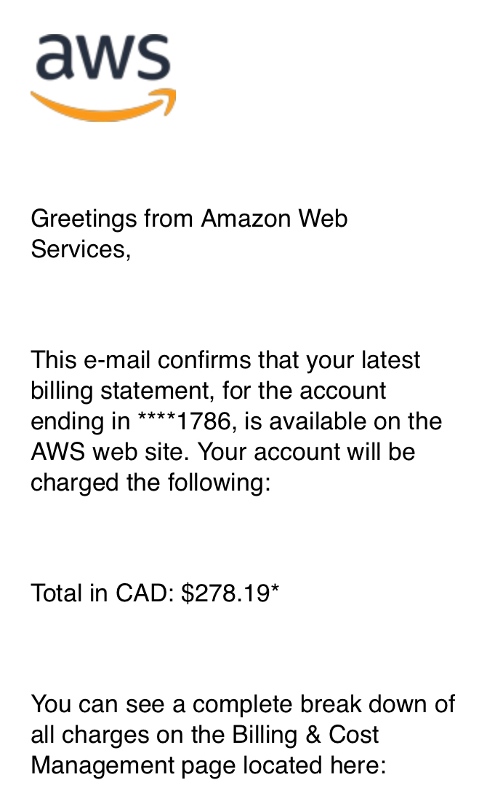

# Superside Application Feedback

Hi Nikita,

I hope you’re doing well! First off, I want to apologize for the delay in getting back to you. Our team was managing some unexpected priorities, which delayed our ability to complete your layout assessment as quickly as we’d hoped. Thank you for your patience, and for the time and effort you invested in all the stages through this process.

We enjoyed learning about your structured approach to Superside’s data architecture, and we appreciated the depth of thought you put into your proposal.

After careful consideration and discussion with the hiring team, we’ve decided not to move forward with your application.

We were impressed by the clarity of your solution and the technical strength you demonstrated in your architecture. Your breakdown of key components—such as AWS and Kubernetes for infrastructure, Airflow for orchestration, and dbt for data transformation—showed a solid grasp of essential data engineering principles. However, for this role, we felt that certain areas of the proposal could be further strengthened to better meet the full scope of the case study’s requirements.

For instance, while your Terraform setup for AWS and EKS was thoughtfully constructed, the inclusion of PostgreSQL as an interim database felt out of place within the overall data flow and would have benefited from clearer integration. Additionally, your approach to data cleansing and normalization showed promise, but we would have liked to see more in-depth technical detail here—especially considering the variety of data sources we handle and our need for high data quality. Integrating this with our Snowflake `DIM_PROJECT` table, with a more robust focus on handling inconsistencies, would have added further insight.

In addition, the orchestration and monitoring components could have used a more production-focused approach. While we appreciate your experience with Airflow, the submission would have benefited from more emphasis on real-world challenges—such as handling network disruptions, data integrity monitoring, and recovery mechanisms. A detailed strategy for making the ETL process resilient and production-ready would have been a valuable addition.

This was a difficult decision, as we see great potential in your technical abilities and structured approach. With further refinement in areas like data preparation and robust pipeline strategies, we’re confident you could be an excellent fit for a similar role in the future.

Thank you again for your time, patience, and interest in Superside. We wish you all the best in your career journey, and we hope to connect again down the road!

Best regards,  
David Ochoa  
Talent Acquisition, Superside

My AWS bill due testing my entire Terraform edition

